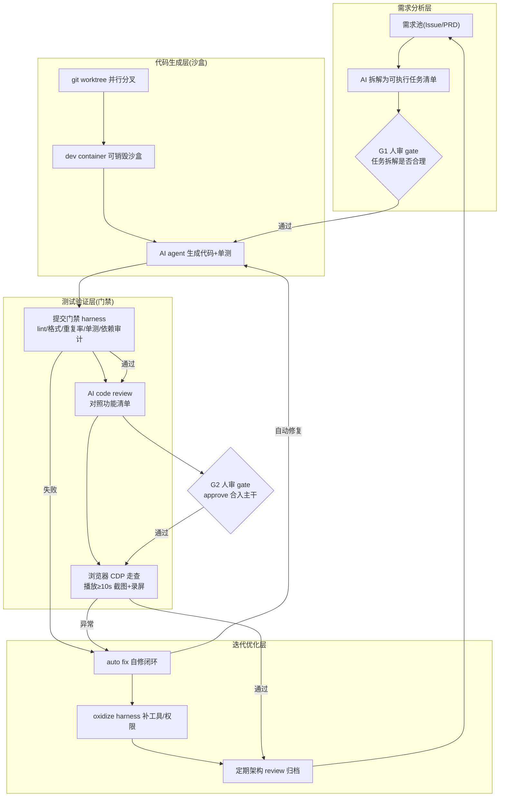

# climb-english 项目 AI 自动开发迭代工作流方案

> 交付日期：2026-08-23 ｜ 底座：徐文浩「harness」方法论（《Vibe Coding 做大项目一定会塌掉，除非……》）
> 一句话主线：**climb-english 不缺方法论，缺「机制层治理」——把「8 条迭代纪律 + 25 条踩坑经验」从 prompt/文档落成「代码门禁 + 自动化」。**

---

## 执行摘要（TL;DR）

项目已有的 RETROSPECTIVE.md（25 个提交 3 个 PR 的完整复盘）+ README 迭代规范（8 条），**本质就是徐文浩说的「harness」的雏形**——但几乎全部靠人肉执行：没有 CI/CD 门禁、没有 AI code review、验证靠人工 `lsof` + 浏览器走查 + 截图存档。

瓶颈不在「缺方法论」，而在「方法论没机制化」。本方案的核心动作：把最痛的 4 个教训（静默兜底毁对齐、启发式漏报、手写数据被覆盖、整仓重写丢功能）一次性落成**能阻断 merge 的硬门禁**，再逐步把「验证人肉化」替换为「浏览器自动走查 + 录屏」，最后让 harness 具备「自我进化」（oxidize）能力。

**分四阶段**：Phase 0 提交门禁（地基）→ Phase 1 数据安全 + AI review（守生命线）→ Phase 2 浏览器走查 + 质量门禁（去人肉化）→ Phase 3 实验 + 自治闭环 + 收敛（自我进化）。

---

## 一、现有工作流瓶颈与优化空间

### 1.1 瓶颈清单（按类别）

| 类别 | 瓶颈 | 根因 |
|---|---|---|
| **内容管线** | 静默兜底毁对齐（33 句 +1 漂移，最严重） | `translate.mjs` 用 fallback 糊索引不匹配，掩盖错误而非报错 |
| | 诊断报喜不报忧（漏报 4 倍） | `check-cue-alignment` 启发式无 ground-truth 对照 |
| | 断句参数凭感觉定 | gap 阈值拍脑袋，无数据驱动搜索 |
| | 模糊匹配阈值连修三次 | backfill 覆盖率硬编码，无自适应 + 无回归护栏 |
| | 生成/手写数据混用 | `lessons.ts` 混放，`build:lessons` 可覆盖手写 Innsbruck ~1800 行 |
| | 双数据模型 | `Lesson/PracticeSentence` 与 `SubtitleCue/VideoEntry` 两套类型/时间轴/工具函数 |
| **运行时开发** | 整仓重写丢功能（两周后才暴露） | 无行为回归测试 + 无功能清单对照 |
| | 单体化回潮（App.tsx 3036 行） | 无模块边界/文件体积卡口 |
| | effect 依赖 key 反馈循环 | `rangeKey` 含 `sentence.id` → seek 重跑，无 lint 拦截 |
| | TDZ 被 try/catch 吞掉（踩两次） | 无静态检查拦截 |
| **质量验证** | UI 验证全靠人工 | lsof + 浏览器走查 + 截图全人肉，无 CDP/Playwright |
| | 播放器跟随类无自动实证 | 「播放 ≥10s 验证」靠人执行，无录屏留证 |
| | 大 PR 混装 | 无 AI code review + 无提交门禁 |
| **数据治理** | 手写数据丢失风险 | 生成/手写无隔离、无覆盖保护 |
| | 死 CSS 2884 行、死代码 | 无 unused 检测卡口 |
| **运维** | 幽灵进程喂错版本（5173 旧服务驻留） | 启动前无端口占用检测 |
| | 无 CI/CD 门禁 | 8 条纪律无一条自动化落地 |
| | 无 auto fix 闭环 | 报错靠人肉排查 |

### 1.2 AI 自动化机会评估（可行度 + 收益）

| 机会 | 可行度 | 收益 |
|---|---|---|
| 提交门禁自动化（lint/格式/重复率/单测/依赖审计） | 高 | 高 |
| AI code review（PR 自动审 + 功能清单对照） | 高 | 高 |
| 翻译对齐 ground-truth 全量回归 + 索引 fail-fast | 高 | 高 |
| 生成/手写数据隔离 + 覆盖保护门禁 | 高 | 高 |
| CDP/Playwright 浏览器自动走查 + 录屏 | 高 | 高 |
| 死 CSS/死代码检测 | 高 | 中 |
| 模块边界架构 lint（文件体积/组件数/依赖） | 高 | 中 |
| 幽灵进程端口守卫 | 高 | 低 |
| 断句参数数据驱动实验 | 中 | 中 |
| 定期架构 review（AI 扫单体/重复/双模型） | 中 | 中 |
| 前端报错 auto fix 闭环 | 中 | 中 |
| oxidize harness（AI 扫自身摩擦） | 中 | 中 |
| 大文件自动重构（AI 直接拆 App.tsx） | 低 | 低（整仓重写前车之鉴） |

> 可行度判据：高 = 成熟工具链直接可用；中 = 需先建基建或需人工把关；低 = 风险高需人工主导。

---

## 二、AI 工作流架构设计（完整闭环）

### 2.1 架构总览

### 2.2 四层闭环的执行主体

- **需求分析层**：A1/A2 由 AI agent 起草，人（PM/主理人）在 **G1** 确认任务拆解是否合理。
- **代码生成层**：B 全程 AI 在沙盒内自主执行（worktree + dev container，**不进主干**）。
- **测试验证层**：C1/C3 全自动硬门禁；C2 是 AI 生成 + 人在 **G2** approve。
- **迭代优化层**：D 由 AI 持续跑，人只挑执行项。

**核心原则：gate 是代码不是 prompt**——失败自动回灌，而不是靠人盯。

---

## 三、人机协作边界

### 3.1 三类模式 + 审批 gate

| 环节 | 模式 | 审批 gate / 触发条件 |
|---|---|---|
| 需求澄清、优先级排序 | 人工主导 | PM 定 P0/P1/P2，AI 不越权 |
| 任务拆解（issue→task） | AI 生成 + 人审 | **G1**：拆解结果需主理人确认后才进生成 |
| 代码生成 + 单测生成 | AI 全自动（沙盒） | 仅在 worktree/dev container 内，不碰主干 |
| 提交门禁（lint/格式/重复率/单测/依赖） | AI 全自动 | 硬门禁，失败直接阻断 merge（**无人工豁免**） |
| AI code review（功能清单对照） | AI 生成 + 人审 | AI 输出 PR 评论，**G2**：人 approve 才可合入 |
| 浏览器走查（CDP 播放截图/录屏） | AI 全自动 | 正常仅归档证据；异常才报警人看 |
| 翻译对齐校验（R2） | AI 全自动 | 索引不匹配 → 直接 throw，不 fallback |
| 生成/手写数据覆盖保护（R3） | AI 全自动阻断 | CI 检测到覆盖手写数据 → fail |
| 数据生成（import:youtube 等管线） | AI 全自动 + 硬校验 | 产出过门禁才落 `.generated` 目录 |
| 架构 review / 大重构 | 人工主导 | 每 sprint 定期，人主导 |
| 发布部署 / 回滚 | 人工主导 | 人手动触发 release / 事故人决策 |
| oxidize 优化项取舍 | AI 生成 + 人审 | AI 给优化计划，人挑执行 |

### 3.2 边界原则

> **凡「影响主干、影响数据正确性、影响用户体验」的，必须有 gate；凡「沙盒内可逆、可回放、有证据」的，放权给 AI 全自动。**

---

## 四、前后对比分析

### 4.1 效率提升预期（分阶段，标注为预期值需实测校准）

| 维度 | 优化前（现状） | 优化后（分阶段） | 预期提升 |
|---|---|---|---|
| 低级错误拦截（格式/重复/坏依赖） | 靠人审，漏检率高 | Phase 0 后 100% CI 拦截 | 人审时间 ↓ ~50% |
| 翻译对齐事故 | 静默兜底，33 句 +1 漂移需人肉逐列 diff | Phase 1 后 fail-fast，事故概率 → 0 | 排查 20min → 秒级定位 |
| 手写数据丢失风险 | 重跑 build:lessons 即毁 ~1800 行 | Phase 1 后 CI 阻断 | 风险归零 |
| UI/播放器验证 | 人工 lsof + 浏览器走查 + 截图，15–30min/次 | Phase 2 后 CDP 自动走查 + 录屏，3–5min/次 | 提效 3–5 倍，且 100% 留证 |
| 功能回归（防重写丢功能） | 无，两周后才发现 | Phase 1 后 AI review 对照功能清单 | 关键功能缺失即时拦截 |
| 迭代摩擦（agent 低级错误反复） | 无量化 | Phase 3 后 oxidize 补工具，摩擦可量化下降 | token 消耗 ↓、单任务耗时 ↓ |

> 说明：以上为**预期值**，需在每个 Phase 落地后用量化数据（PR 周转时间、门禁拦截数、走查耗时、auto fix 成功率）校准。不建议在 Phase 0 前就承诺具体倍数。

### 4.2 潜在风险与应对策略

| # | 风险 | 影响 | 应对策略 |
|---|---|---|---|
| 1 | **过度自动化重蹈「整仓重写丢功能」覆辙** | 高：AI 全自动写代码可能再次蒸发功能 | worktree 沙盒 + 功能清单对照 gate + AI review，大重构仍人工主导（架构层已明确） |
| 2 | **门禁漏报**（启发式像 check-cue-alignment 漏报 4 倍） | 高：门禁形同虚设 | 关键路径用 fail-fast 硬校验（非启发式）+ ground-truth 回归测试；启发式只报警不阻断 |
| 3 | **AI 覆盖手写数据** | 高：数据丢失 | generated/manual 目录隔离 + manifest hash 校验 + CI `git diff` 检测 |
| 4 | **AI review 幻觉 / 依赖过期建议** | 中：错误建议误导合入 | review 只作建议非强制，人 approve 才合入；依赖审计用真实 lockfile 而非 AI 判断 |
| 5 | **harness 本身成为新的维护负担** | 中：门禁/脚本也是代码要维护 | 分阶段最小可用起步；Phase 3 oxidize 让 harness 自我进化 |
| 6 | **认知负担**（一次收 8 类汇报直接摆烂） | 中：人懈怠 | 按类别分频道日报，AI 每天只报一类（方法论第 6 条） |
| 7 | **密钥泄露**（DeepSeek key 进代码/前端） | 高：安全 | 密钥只存 CI secrets / `.env`（已 gitignore），`VITE_` 变量禁止放密钥（现有约定已覆盖，门禁加审计） |
| 8 | **幽灵进程/环境假象** | 中：验证了错版本 | Phase 3 端口守卫 + 走查前探测进程归属（复盘 #9） |

---

## 五、分阶段落地建议

### 5.1 路线图

#### Phase 0 — 提交门禁 harness（先搭地基，R1 主体）
- **目标**：把 lint/格式/重复率/单测/依赖审计从人肉落成 CI，给 AI 第一道「缰绳」。
- **先搭什么**：`.github/workflows/ci.yml` + pre-commit hook（husky）。
- **技术选型**：GitHub Actions + ESLint(typescript-eslint) + Prettier + jscpd(重复率) + node --test + `npm audit` + `tsc -b`（复用现有 build）。
- **验证**：任意 PR 触发全量门禁矩阵并行跑；现有 16 例单测 + `npm run build` 全绿。
- **验收**：人为提交「格式错误/重复代码/坏依赖」→ CI 红色阻断 merge，无人工豁免通道。

#### Phase 1 — 数据安全门禁 + AI review（R2/R3/R4）
- **目标**：守住「数据正确性」这条生命线，引入 AI 审。
- **先搭什么**：
  - R2：`check:alignment` 从启发式巡检升级为**硬校验**，en/zh 索引不匹配直接 throw（非 fallback），接入 CI 全量回归。
  - R3：`lessons.ts` 拆分 `lessons.generated.ts` + `lessons.manual.ts`；`build:lessons` 只写 generated，写前做 manifest(hash) 校验，覆盖手写段 → CI fail。
  - R4：PR 触发 AI review，把「PR diff + 功能清单」喂 DeepSeek API，输出结构化评论贴回 PR。
- **验收**：人为注入对齐错位 → CI fail；人为跑 build:lessons 覆盖手写数据 → CI fail；任意 PR 自动收到 AI review 评论，关键功能缺失被拦截。

#### Phase 2 — 浏览器走查 + 质量门禁（R5/R6/R7）
- **目标**：把「浏览器人肉走查」和「边界/死代码检查」机制化。
- **先搭什么**：
  - R5：Playwright（走 CDP）+ 录屏，播放器自动播放 ≥10s 截图归档到 CI artifact。
  - R6：模块边界 lint——ESLint 复杂度规则 + dependency-cruiser/madge 依赖审计，文件行数/组件数/依赖超阈值告警。
  - R7：死代码/死 CSS——knip + PurgeCSS。
- **验收**：每 PR 自动产出走查截图/录屏可查；App.tsx(3036 行) 超阈值触发告警；死代码检测零误报阈值稳定。

#### Phase 3 — 实验 + 自治闭环 + 收敛（R8/R9/R10/R11/R12）
- **目标**：让 harness 会「自我进化」，收口历史技术债。
- **先搭什么**：R8 断句参数数据驱动实验（矩阵搜索留档）；R9 幽灵进程端口守卫；R10 前端报错 auto fix 闭环；R11 oxidize harness；R12 双数据模型收敛。
- **验收**：迭代摩擦可量化下降；auto fix 成功率可统计；R12 收敛后删冗余模型、全量单测仍绿。

### 5.2 工具链落地映射（→ climb-english 单包结构）

1. **GitHub Actions 门禁矩阵**：单包结构用「一个 workflow 多 job 并行」而非多包矩阵。job 拆为 `lint / format / dup / test / audit / build / align-check / data-protect`，复用 `npm ci` 缓存，失败互不阻塞、整体 status 聚合判定。
2. **AI code review 触发**：`pull_request` 事件 → 拉 diff → 拼接功能清单 → 调 DeepSeek（复用现有 API key 管线）→ 结构化评论（功能缺失/逻辑 bug/边界遗漏）→ `gh` CLI 回贴。仅新 diff 触发，避免重复。
3. **Playwright/CDP 走查**：新增 `e2e/` + `playwright.config.ts`，`webServer` 指向 Vite dev server；`page.video()` 录屏 + 固定时间点 `screenshot()`，走 CDP 取播放器真实状态（对齐方法论第 8 条，非截图视觉判断）。
4. **生成/手写数据隔离**：目录约定 `src/data/generated/`（可覆盖）与 `src/data/manual/`（只读受保护）；`build:lessons` 只在 generated 内写；CI 用 `git diff --name-only` 检测 build 产物是否触碰 manual 目录。
5. **worktree + dev container 并行沙盒**：每个任务 `git worktree add` 分叉 + devcontainer 可销毁，AI 睡觉也在远程服务器并行干活（方法论第 3 条）。
6. **oxidize 闭环**：摩擦日志（AI 执行卡点自动记录）→ 定期汇总为优化计划 → 人挑执行 → 补工具/权限（方法论第 5 条）。
7. **汇报分类降噪**：按类别（门禁失败/走查异常/数据校验/架构告警）分频道日报，AI 每天只报一类（方法论第 6 条）。

---

## 六、需求池索引（R1–R12）

| ID | 需求 | 解决瓶颈 | 阶段 |
|---|---|---|---|
| R1 | 提交门禁 harness | 方法论靠人肉、无 CI/CD | Phase 0 |
| R2 | 翻译对齐 fail-fast + 全量回归 | 静默兜底毁对齐、漏报 4 倍 | Phase 1 |
| R3 | 生成/手写数据隔离 + 覆盖保护 | lessons.ts 混用数据丢失 | Phase 1 |
| R4 | AI code review 门禁 | 整仓重写丢功能、大 PR 混装 | Phase 1 |
| R5 | 浏览器自动走查（CDP/Playwright+录屏） | UI 验证靠人工 | Phase 2 |
| R6 | 模块边界架构 lint | App.tsx 3036 单体化 | Phase 2 |
| R7 | 死 CSS/死代码检测 | styles.css 2884 死规则 | Phase 2 |
| R8 | 断句参数数据驱动实验 | gap 阈值拍脑袋 | Phase 3 |
| R9 | 幽灵进程端口守卫 | 5173 旧服务喂错版本 | Phase 3 |
| R10 | 前端报错 auto fix 闭环 | 报错靠人肉 | Phase 3 |
| R11 | oxidize harness | agent 低级错误反复 | Phase 3 |
| R12 | 双数据模型收敛 | 两套类型/时间轴/工具函数 | Phase 3 |

---

## 附：方法论与项目现状的接合点

| 徐文浩方法论 | climb-english 现状 | 落地动作 |
|---|---|---|
| 纯 vibe coding 做大项目必塌，唯一解是 harness | RETROSPECTIVE 25 条踩坑已证明 | Phase 0 门禁 harness 起步 |
| 几十道门禁自动开跑 | 8 条纪律全人肉 | R1 + R2 + R3 落成硬门禁 |
| 机制层治理是代码不是 prompt | 纪律只写在 README | 全部纪律落成 CI/lint/脚本 |
| 每个任务上沙盒 | 无沙盒，整仓重写丢功能 | worktree + devcontainer |
| 浏览器用 CDP 非截图 | 人工走查 + 截图 | R5 Playwright + 录屏 |
| 让 AI 每天只汇报一类事 | 无汇报机制 | 分频道日报 |
| oxidize harness 自我进化 | 无摩擦量化 | R11 摩擦日志 + 优化计划 |

**核心判断**：最该先做的是 Phase 0 的门禁 harness——它是后续所有 AI 自动化的**信任地基**。没有一道能阻断 merge 的硬门禁，放权给 AI 就是灾难；有了它，AI 的「并行 + 自修 + 走查」才有安全边界。
