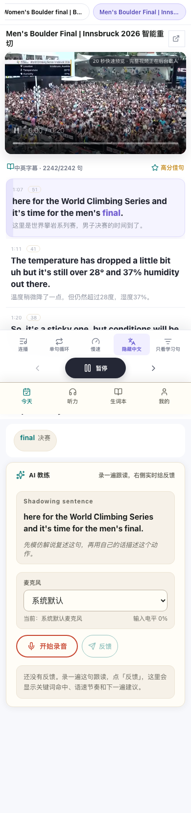
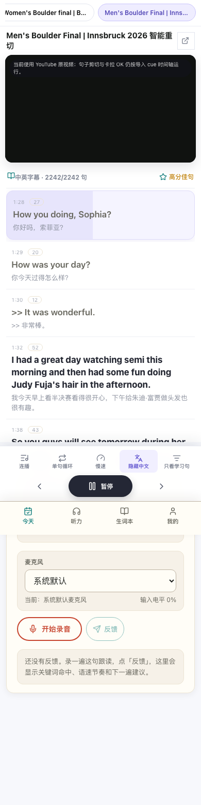

# Mobile karaoke pre-roll verification

Date: 2026-08-25

Viewport: 390 × 844

Harness: Playwright Chromium, real Git preview MP4, deterministic fake YouTube API

## Result

The 0.3-second value is still useful as **preview-asset capture padding**, but it
is no longer needed as a runtime karaoke seek offset.

- Preview start: 67.23 s
- First cue start: 67.53 s
- Observed preview seek target: 0.30 s relative to the preview asset
- Handoff cue: index 4, absolute start 88.97 s
- Observed final YouTube seek target: 88.97 s
- Active cue after 500 ms on YouTube: index 4

The new regression failed with the old runtime pre-roll and passed after
`useCuePlayer` began seeking directly to each cue boundary.

## Visual evidence

First cue active while the Git preview is playing:

Cue 4 remains active after the preview-to-YouTube handoff:

The handoff screenshot uses a deterministic fake YouTube player, so its black
media pane is expected; the evidence under test is the source transition,
absolute seek target, and active subtitle cue.
